# **SWE4-Übungen - SS2024 - Übungszettel 5 - Ausarbeitung**

## **EURO-Bet - Ausbaustufe 1**

### **Lösungsidee**

Am Anfang des Projektes habe ich mir zuerst das Design / den Aufbau der GUI überlegt. Durch die ersten Entwürfe, bin ich zu der Entscheidung gekommen, dass ich diese Anwendung responsive aber nur für PC und Tablett machen möchte, da das Handy-Format sich doch nochmal deutlich unterscheidet und nicht so einfach mit JavaFX umzusetzen ist. Als Default Auflösung habe ich 1200x800 pixel gewählt.

Hier sieht man die ersten Entwürfe:

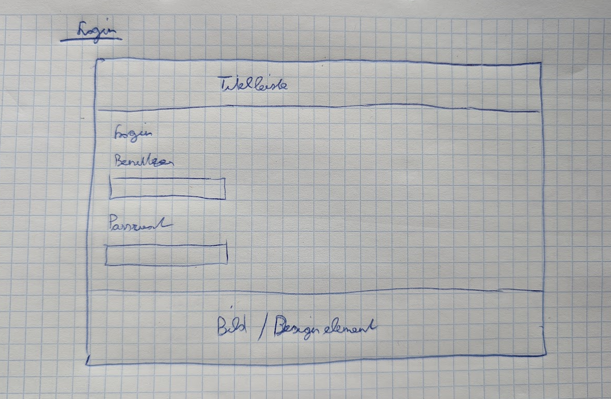

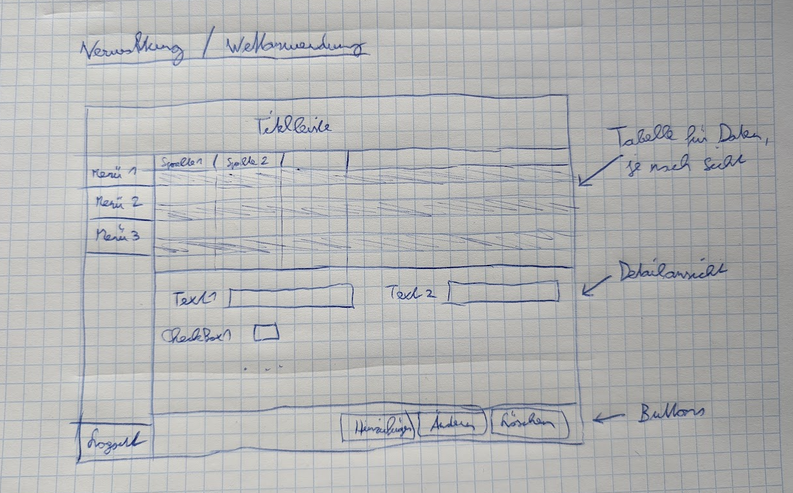

Im fertigen Design sieht es dann so aus:

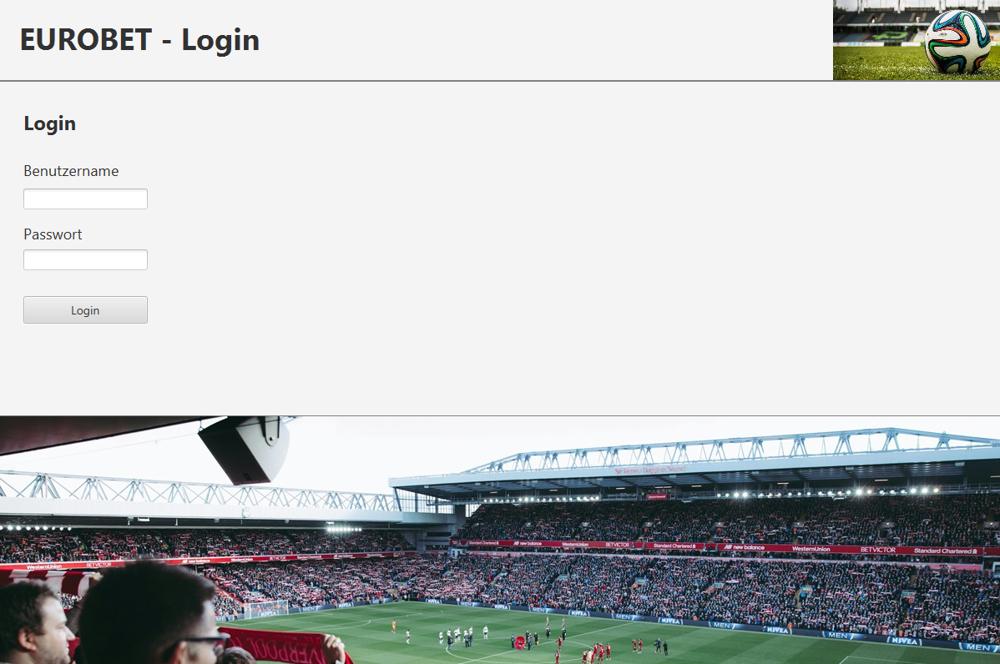

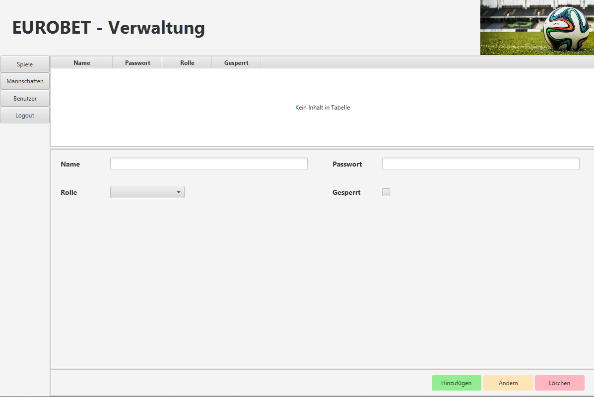

Ein Unterschied, der vielleicht auffällt, ist das der Logout Button jetzt weiter oben ist. Das liegt an der verwendeten VBox, die ich für die Anordnung der Elemente verwendet habe.

Die Anwendung besteht auf insgesamt 3 Seiten, als einzelne FXML-Dateien:
- Login
- Verwaltung
- Wettanwendung

Login ist die Startseite, wo man sich mit Benutzername und Passwort anmelden kann. Die Benutzerdaten sind derzeit in einer Liste gespeichert. Je nach dem welche Rolle der Benutzer hat wid er entweder in die Verwaltung (ADMIN) oder in die Wettanwendung (USER) weitergeleitet.

Verwaltung beinhaltet Tabellen und Felder zum Eintragen von Spielen, Mannschaften und Benutzern.

Wettanwendung beinhaltet Tabellen und Felder zum Eintragen von Spiel-Tipps und zum Anzeigen der Punkte aller Benutzer.

Als besonders nennenswerte Datentypen kann man vielleicht die Property und die ObservableList nennen. Diese sind sehr hilfreich, in JavaFX, da man damit auf Werteänderungen oder auf ein selektieren einer Zeile in einer Tabelle einfach reagieren kann.

Außerdem wurde darauf geachtet, dass die Anwendung leicht erweiterbar ist, zB. für die Datenbankanbindung durch Dao's (Data Access Objects) oder für die Erweiterung der Wettanwendung um weitere Funktionen.

### **Testfälle**

Die Bedienung der Anwendung wurde sehr ausführlich getestet. Es sind alle Menüs erreichbar. Die Eingabe von Daten in die Tabellen funktioniert. Die Anzeige der Tabellen funktioniert. 

In der Usability Lehrveranstalung haben wir gelernt, das der User bei jeder Aktion ein Feedback erhalten soll. Deshalb wurde bei jedem Button klick, eine Rückmeldung implementiert, die anzeigt, ob die Aktion erfolgreich war (grün) oder nicht (rot).

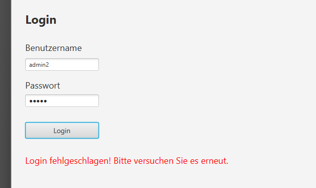

Meldung weil der username falsch ist. Um die Bedienung / Usabilty zu verbessern muss man den Button nicht drücken sondern kann sich auch mit ENTER einloggen.

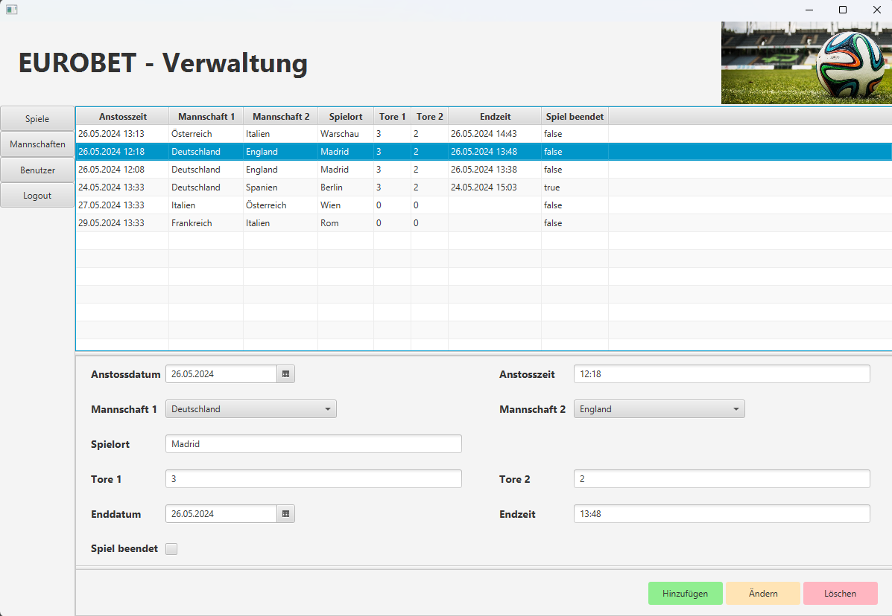

Verwaltung mit ausgewähltem Datensatz.

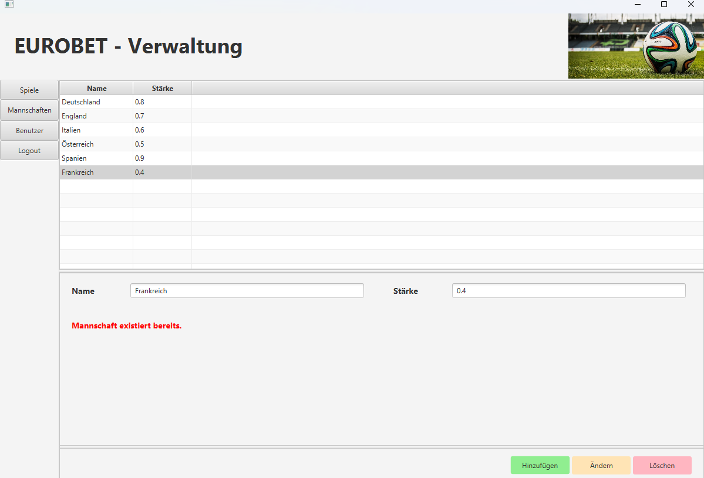

Mannschaften, hinzufügen nicht möglich, da der Name schon existiert.

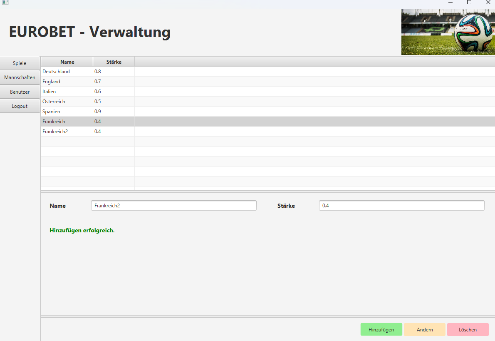

Hinzufügen erfolgreich.

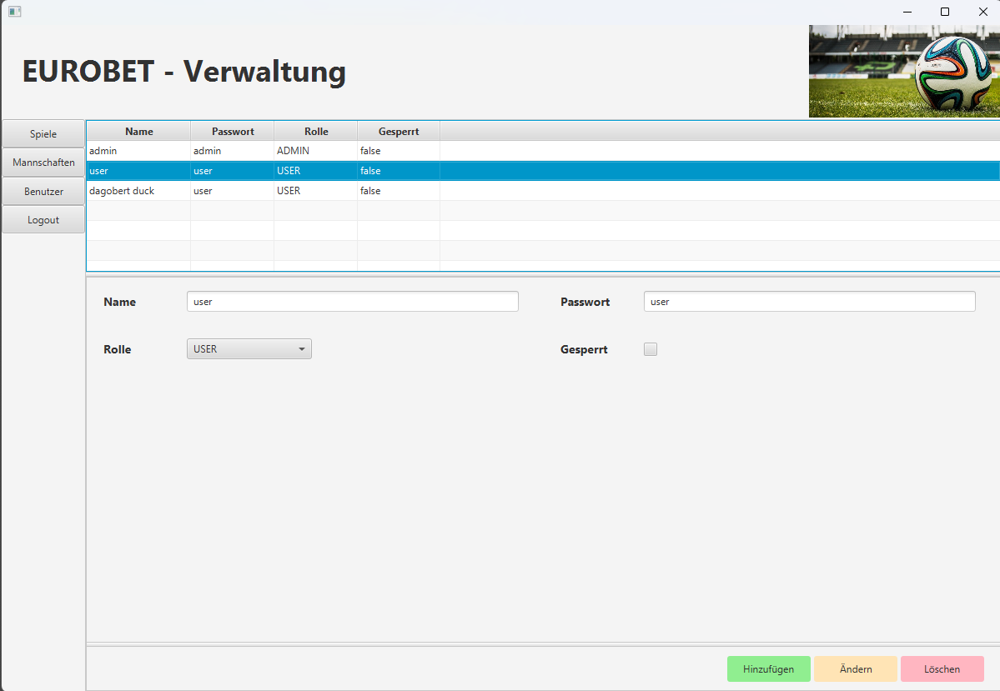

Benutzerübersicht.

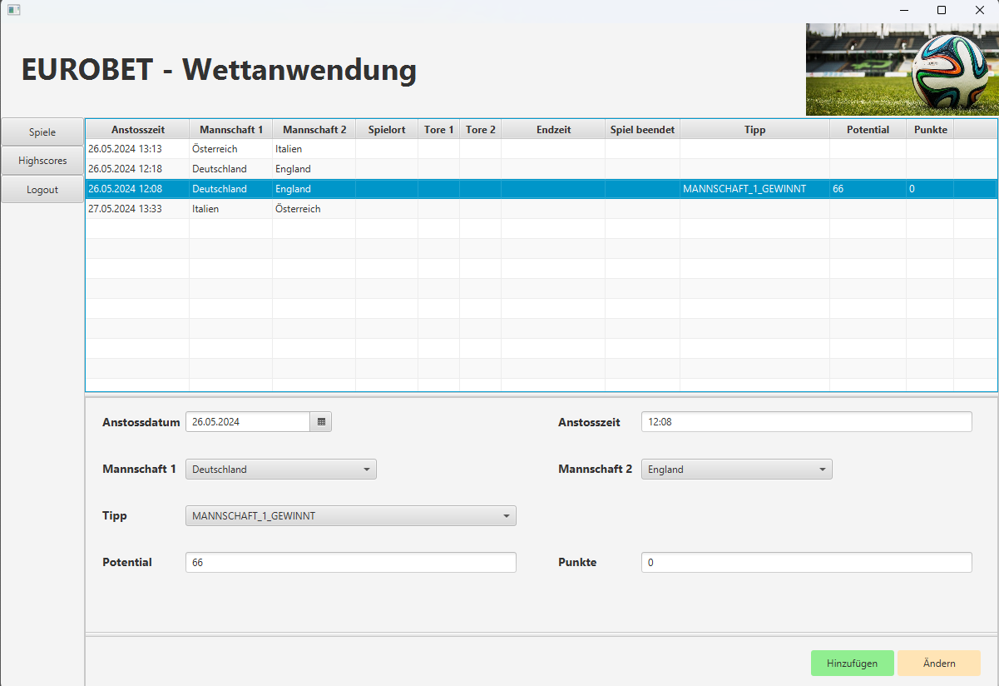

Wettanwendung mit den Spielen und einem SpielTipp im Detail. Je nachdem wann der Tipp abgegeben wurde, und wie die Spielstärke der Mannschaften im Vergleich ist wird ein Potential an Punkten berechnet und eingetragen. Wenn das Spiel abgelaufen ist und der Tipp richtig war, werden dem Benutzer die Punkte gutgeschrieben.

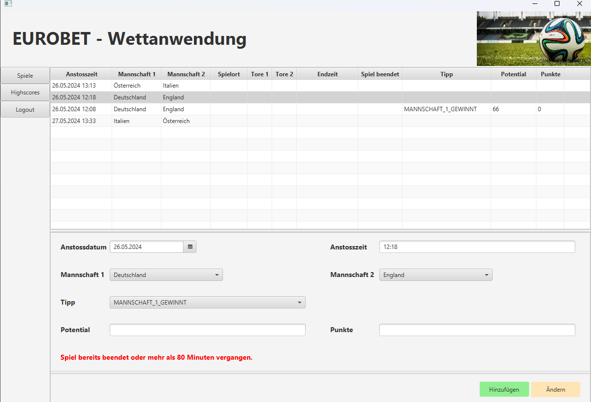

Tipp nicht möglich, da das Spiel schon mehr als 80 Minuten läuft.

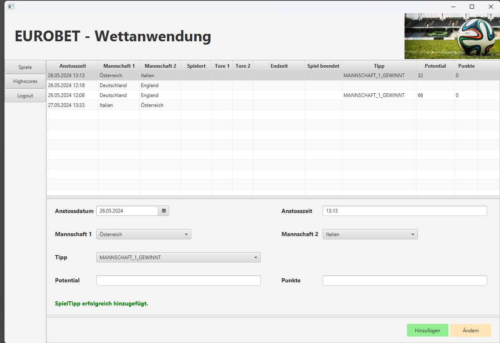

Tipp eingetragen.

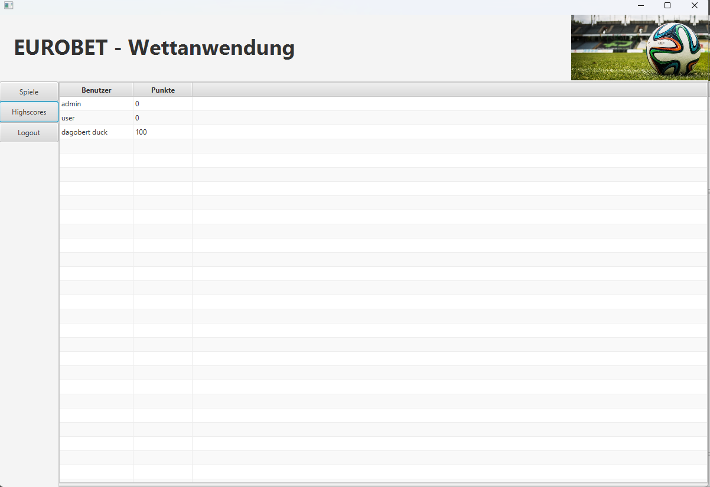

Highscore Tabelle.

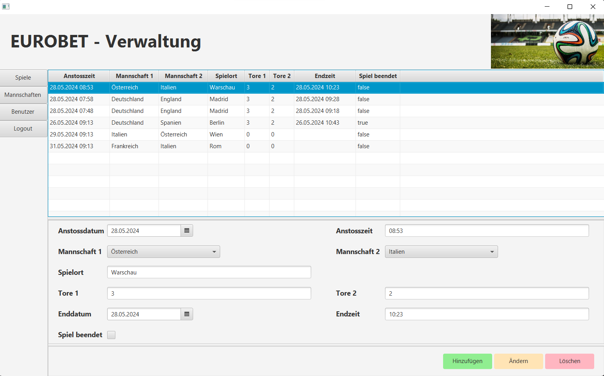

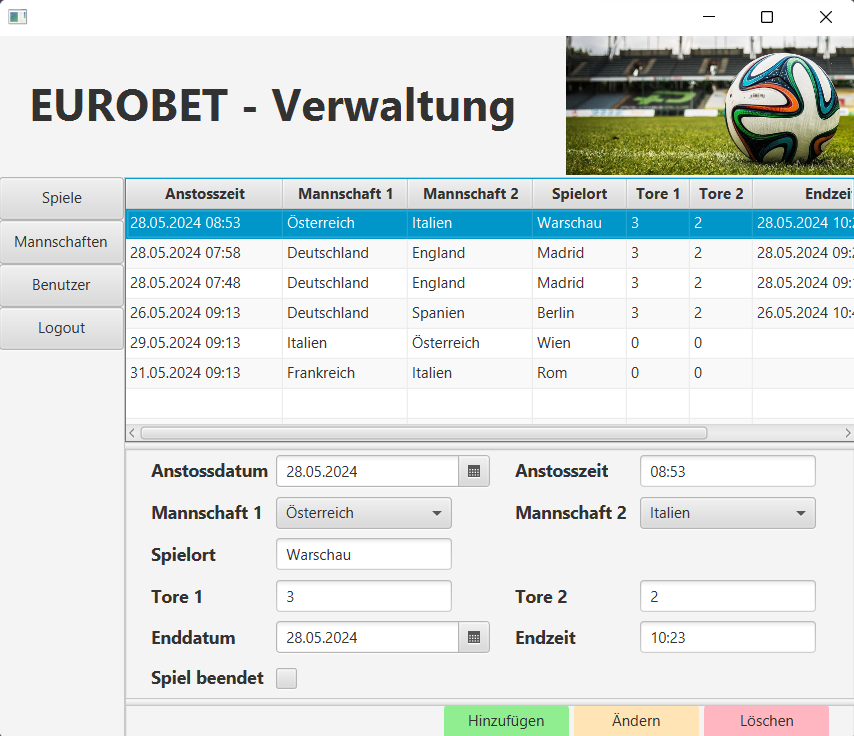

Hier sieht man ein Beispiel für das responsive Design, den Vergleich in voller Größe und die Minimumgröße für Tablets. Auch in der kleinen Größe sind alle Elemente sichtbar und bedienbar.

