# **SWE4-Übungen - SS2024 - Übungszettel 6 - Ausarbeitung**

## **EURO-Bet - Ausbaustufe 2**

### **Lösungsidee**

In der Ausbaustufe 2 wurde die Anwendung in eine Client-Server Architektur geändert.

Dafür habe ich die Anwendung in mehrere Teile aufgeteilt:

- **Client**: Die JavaFX Anwendung, die die GUI darstellt und die Benutzerinteraktionen entgegennimmt.
- **Server**: Ein Java Programm, das die Datenhaltung und die Geschäftslogik übernimmt.

Für den Server habe ich ein Interface erstellt, welche Methoden ich anbiete. Dieses Interface wird dann von der Server-Klasse implementiert. Die Server-Klasse ist dann die Klasse, die die eigentliche Logik enthält. 
Außerdem enthält sie eine Instanz des DatenManagers, der die Datenhaltung übernimmt.

Der Client verbindet sich über RMI mit dem Server und kann dann die Methoden des Interfaces aufrufen. Die Daten werden dann über das Interface ausgetauscht.
Im Client habe ich die Datenhaltung entfernt und die Datenhaltung komplett auf den Server verlagert. 
Der Client ist außerdem für die grafische Darstellung der Daten zuständig und für die Benutzerinteraktionen.

Bei RMI muss man beachten, dass man den EuroBetServer als Remote-Objekt registriert und bindet.

Der Client muss dann eine Verbindung zur Registry aufbauen und das Remote-Objekt des Servers holen aus eine lookup Table.

Der DatenManager aht weiterhin die Dao Klassen, die es hoffentlich in der 3. Ausbaustufe einfacher machen die Datenbank einzubinden.

Um der Anforderung gerecht zu werden, dass die GUI bedienbar bleibt wenn Hintergrundprozesse ausgeführt werden, habe ich JavaFX Tasks implemenentiert.
Ein JavaFX Task ist ein Hintergrundprozess, der in einem eigenen Thread ausgeführt wird. Mit task.setOnSucceeded() kann man dann den Task beenden und das Ergebnis in der GUI anzeigen.

### **Testfälle**

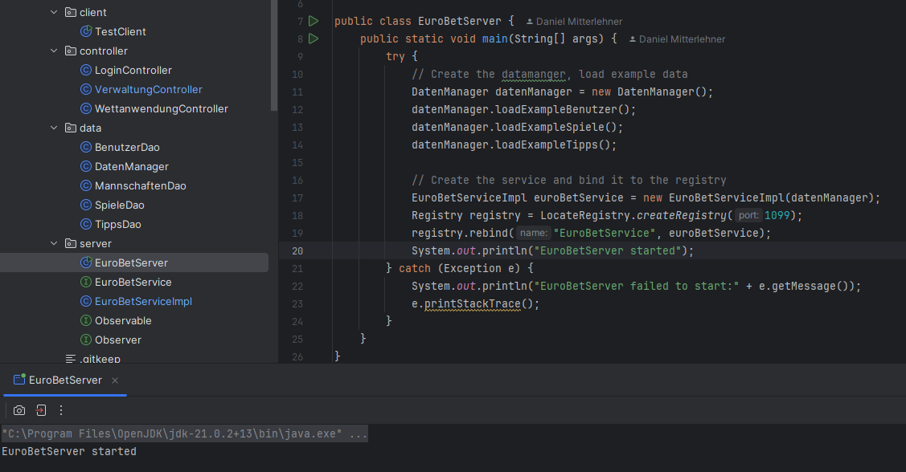

Server gestartet

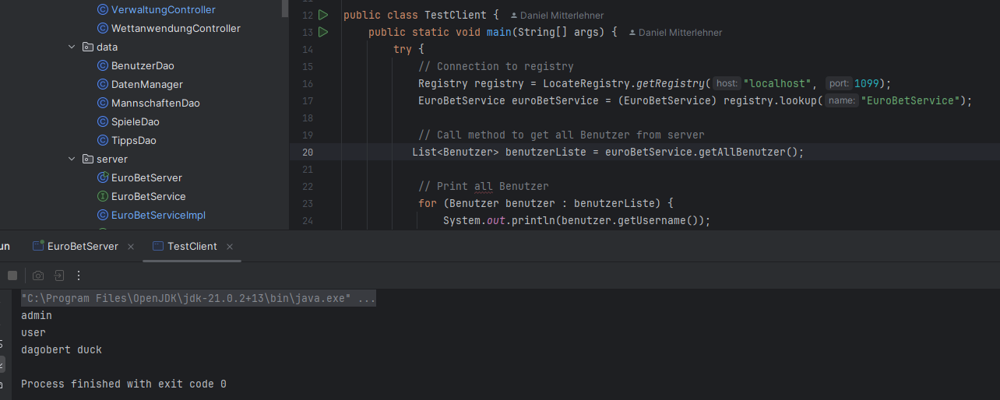

Kleiner Testclient, der einfach nur die Verbindung zum Server aufbaut und eine Methode aufruft, die dann alle Beispiel Benutzer anzeigt.

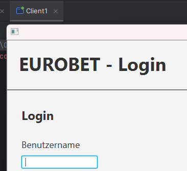

Client 1 gestartet.

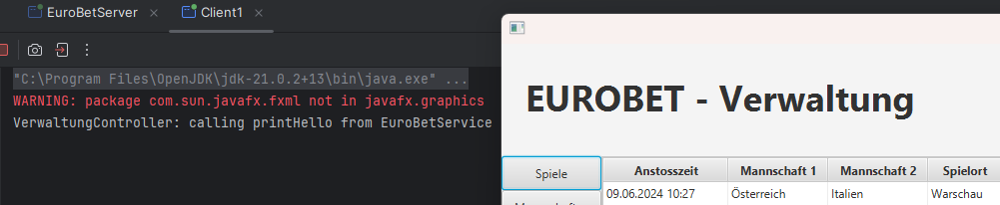

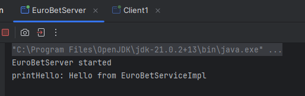

Nach dem Einloggen ruft der VerwaltungsController die Testmethode printHello vom Server auf.

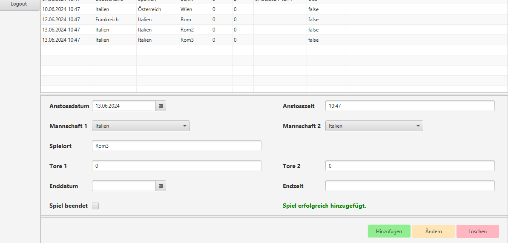

Spiel hinzugefügt

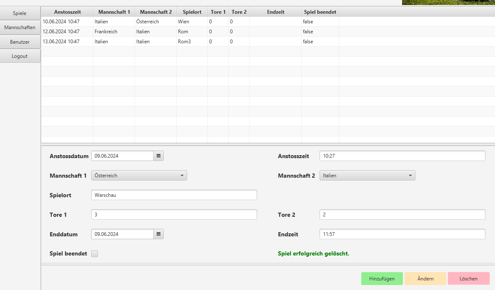

Spiel gelöscht

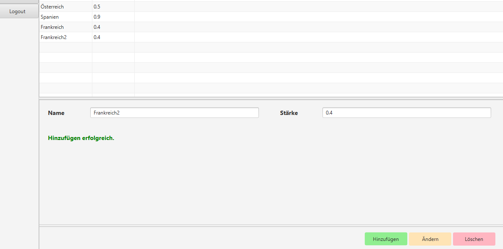

Mannschaft hinzufügen

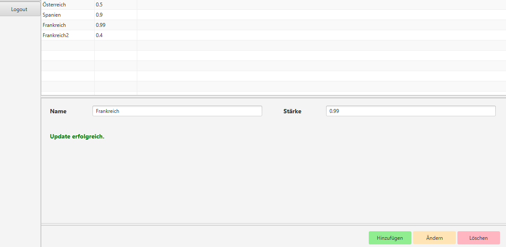

Mannschaft ändern

...

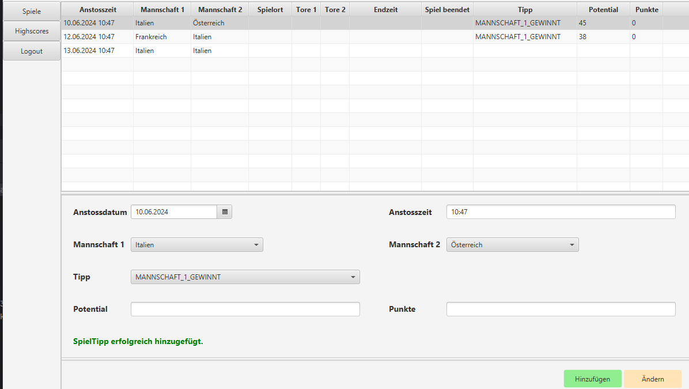

Jetzt in die Wettanwendung gewechselt, Spiel Tipp hinzufügen.

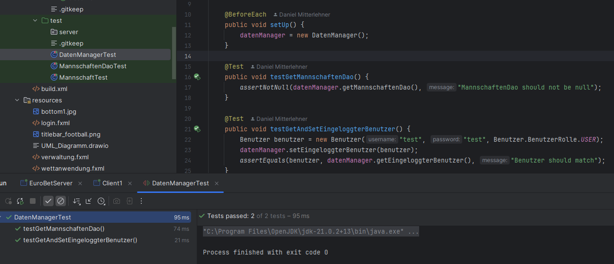

Unit Test: DatenManager

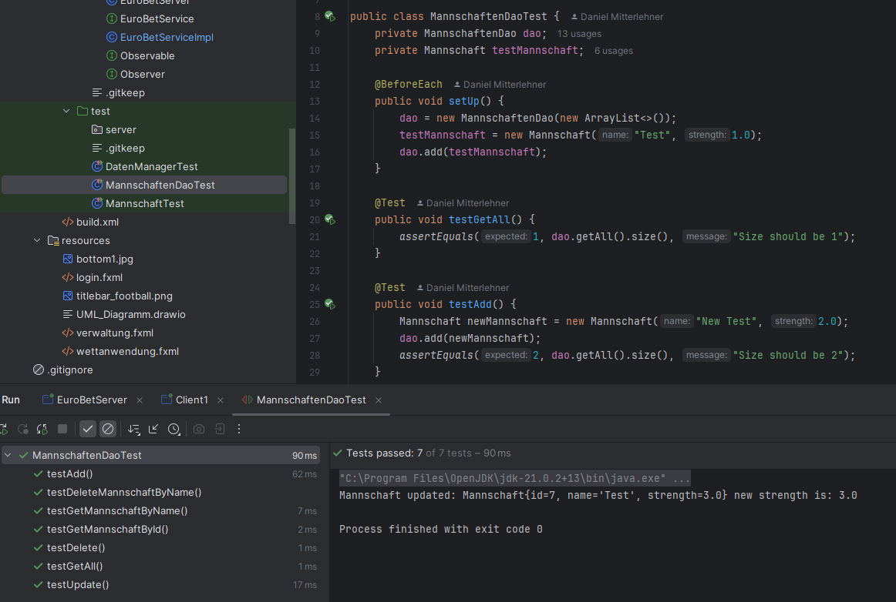

Unit Test: MannschaftenDao

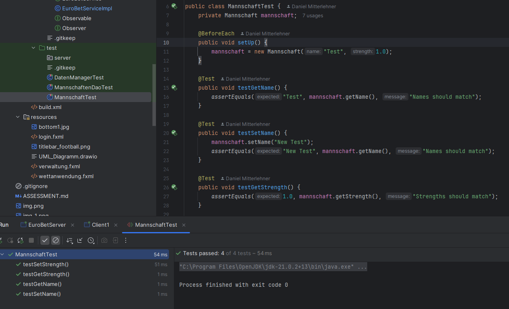

Unit Test: Mannschaft

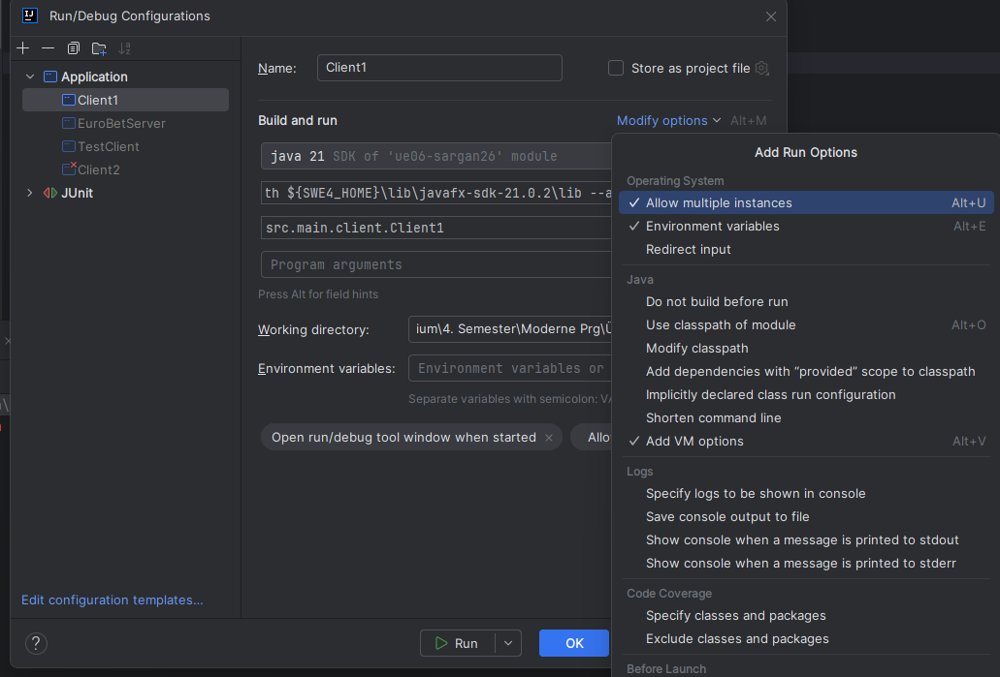

Einstellung damit der Client mehrmals ausgeführt werden kann.

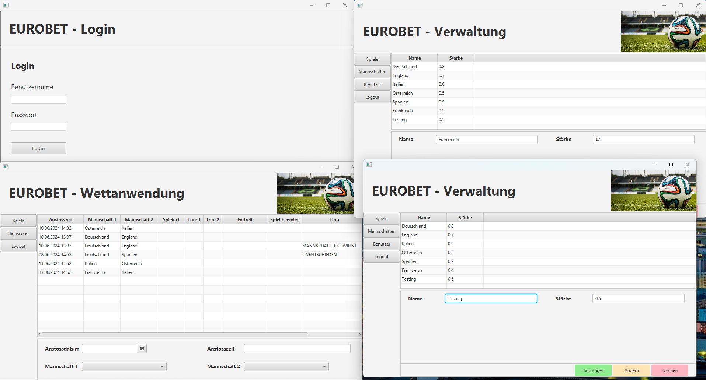

Mehrere Clients laufen. Habe bei einem Client eine Mannschaft hinzugefügt, die wird beim anderen Client auch angezeigt.
